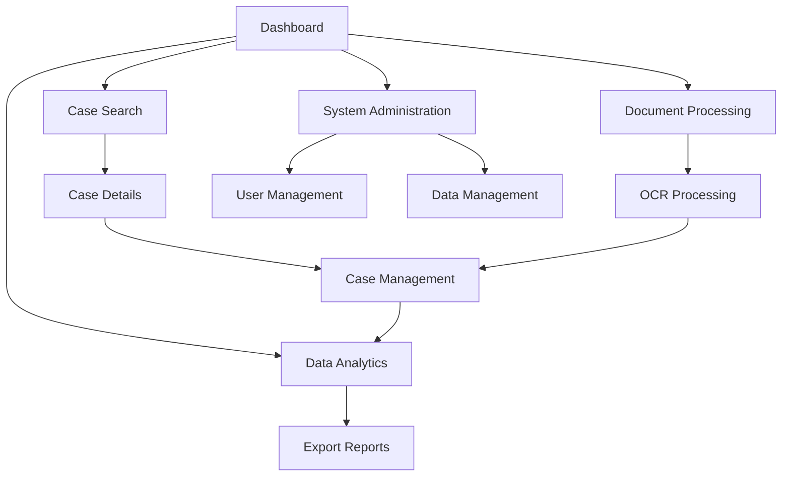

# Product Requirements Document: PBOC Regulatory Penalty Analysis System

## 1. Product Overview
A comprehensive web application for analyzing People's Bank of China regulatory penalties, enabling users to search, update, process, and visualize regulatory case data from multiple regional PBOC branches.

The system helps regulatory analysts, compliance officers, and researchers efficiently manage and analyze penalty cases, supporting data-driven decision making in financial compliance monitoring.

## 2. Core Features

### 2.1 User Roles
| Role | Registration Method | Core Permissions |
|------|---------------------|------------------|
| Admin User | System invitation | Full access to all features, data management, system configuration |
| Analyst | Email registration with approval | Case search, analysis, export, limited update permissions |
| Viewer | Email registration | Read-only access to search and view cases |

### 2.2 Feature Module
Our PBOC penalty analysis system consists of the following main pages:
1. **Dashboard**: System overview, statistics summary, recent activities, quick access navigation
2. **Case Search**: Advanced search interface, filter options, result display with pagination
3. **Case Management**: Case details view, bulk operations, status updates, data validation
4. **Document Processing**: File upload interface, OCR processing, document conversion tools
5. **Data Analytics**: Visualization charts, trend analysis, statistical reports, export functions
6. **System Administration**: User management, data import/export, system configuration

### 2.3 Page Details
| Page Name | Module Name | Feature description |
|-----------|-------------|---------------------|
| Dashboard | Statistics Overview | Display total case counts by region, recent updates, processing status summary |
| Dashboard | Quick Actions | Provide shortcuts to common tasks like search, upload, and export |
| Dashboard | Activity Feed | Show recent system activities and user actions |
| Case Search | Search Interface | Advanced search with multiple filters (date range, region, penalty type, amount) |
| Case Search | Results Display | Paginated table with sorting, filtering, and export options |
| Case Search | Case Preview | Quick view modal with key case information |
| Case Management | Case Details | Complete case information display with edit capabilities |
| Case Management | Bulk Operations | Select multiple cases for batch updates, exports, or deletions |
| Case Management | Data Validation | Verify case data integrity and highlight inconsistencies |
| Document Processing | File Upload | Support PDF, DOCX, images with drag-and-drop interface |
| Document Processing | OCR Processing | Convert scanned documents to searchable text using OCR |
| Document Processing | Document Conversion | Transform various document formats to standardized text |
| Data Analytics | Visualization Charts | Interactive charts showing penalty trends, regional distributions |
| Data Analytics | Statistical Reports | Generate comprehensive reports with filtering options |
| Data Analytics | Export Functions | Download data in multiple formats (CSV, Excel, PDF) |
| System Administration | User Management | Create, edit, delete users and manage permissions |
| System Administration | Data Management | Import/export system data, database maintenance |
| System Administration | Configuration | System settings, regional branch management, category definitions |

## 3. Core Process

**Admin Flow:**
1. Admin logs in and accesses the dashboard
2. Reviews system statistics and manages user accounts
3. Configures system settings and regional branch information
4. Monitors data quality and performs maintenance tasks

**Analyst Flow:**
1. User logs in and views dashboard with recent activities
2. Uses advanced search to find specific penalty cases
3. Reviews case details and processes new documents via OCR
4. Updates case information and generates analytical reports
5. Exports data for external analysis or reporting

**Data Processing Flow:**
1. System automatically scrapes new cases from PBOC regional websites
2. Documents are processed through OCR for text extraction
3. Data is validated and stored in the database
4. Users are notified of new cases and processing results

## 4. User Interface Design

### 4.1 Design Style
- **Primary Colors**: Blue (#2563eb) for primary actions, Gray (#64748b) for secondary elements
- **Secondary Colors**: Green (#16a34a) for success states, Red (#dc2626) for errors, Yellow (#ca8a04) for warnings
- **Button Style**: Rounded corners (8px), subtle shadows, hover animations
- **Typography**: Inter font family, 14px base size, clear hierarchy with 16px-24px headings
- **Layout Style**: Clean card-based design, consistent spacing (16px grid), responsive sidebar navigation
- **Icons**: Lucide React icons for consistency, 20px standard size

### 4.2 Page Design Overview
| Page Name | Module Name | UI Elements |
|-----------|-------------|-------------|
| Dashboard | Statistics Cards | Clean white cards with colored accents, large numbers, trend indicators |
| Dashboard | Navigation Sidebar | Dark blue sidebar with white icons, collapsible on mobile |
| Case Search | Search Form | Grouped form fields, date pickers, multi-select dropdowns with shadcn/ui components |
| Case Search | Results Table | Striped table with hover effects, sortable columns, pagination controls |
| Case Management | Detail View | Two-column layout, tabbed sections, inline editing with form validation |
| Document Processing | Upload Area | Drag-and-drop zone with progress indicators, file type icons |
| Data Analytics | Charts | Interactive Plotly charts with consistent color scheme, responsive design |
| System Administration | Management Tables | Data tables with action buttons, modal dialogs for editing |

### 4.3 Responsiveness
Desktop-first responsive design with mobile optimization. Touch-friendly interface for tablet users with larger tap targets and swipe gestures for navigation. Responsive breakpoints at 768px (tablet) and 1024px (desktop).