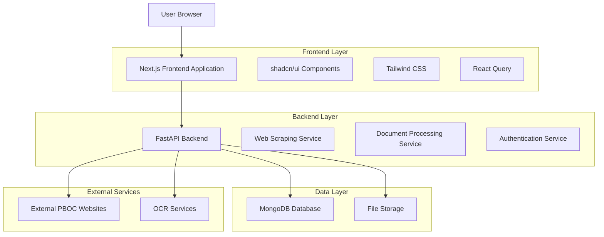
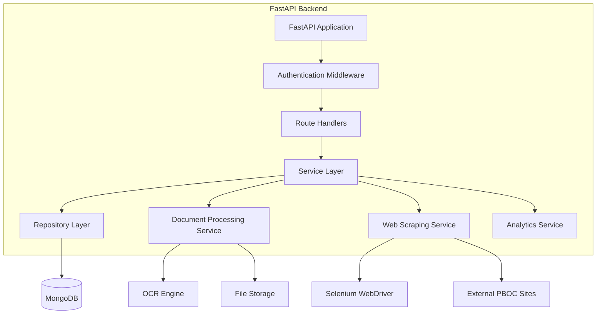
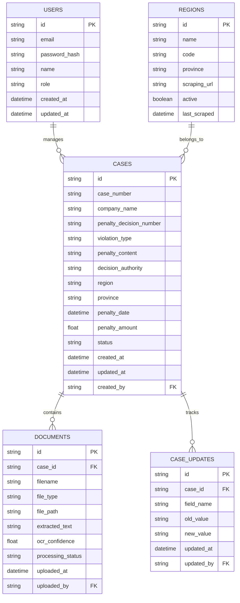

# Technical Architecture Document: PBOC Penalty Analysis System Migration

## 1. Architecture Design



## 2. Technology Description

* **Frontend**: Next.js\@14 + React\@18 + TypeScript + shadcn/ui + Tailwind CSS\@3 + React Query

* **Backend**: FastAPI + Python\@3.11 + Pydantic + Motor (async MongoDB driver)

* **Database**: MongoDB (existing)

* **Authentication**: NextAuth.js (frontend) + JWT (backend)

* **File Processing**: PyMuPDF, python-docx, pytesseract, opencv-python

* **Web Scraping**: Selenium WebDriver, BeautifulSoup4

* **Deployment**: Docker containers for both frontend and backend

## 3. Route Definitions

| Route           | Purpose                                            |
| --------------- | -------------------------------------------------- |
| /               | Dashboard page with system overview and statistics |
| /login          | Authentication page for user login                 |
| /search         | Case search interface with advanced filters        |
| /cases/\[id]    | Individual case detail view and editing            |
| /cases          | Case management with bulk operations               |
| /documents      | Document upload and processing interface           |
| /analytics      | Data visualization and reporting dashboard         |
| /admin          | System administration panel                        |
| /admin/users    | User management interface                          |
| /admin/settings | System configuration settings                      |

## 4. API Definitions

### 4.1 Core API

**Authentication**

```
POST /api/auth/login
```

Request:

| Param Name | Param Type | isRequired | Description        |
| ---------- | ---------- | ---------- | ------------------ |
| email      | string     | true       | User email address |
| password   | string     | true       | User password      |

Response:

| Param Name     | Param Type | Description              |
| -------------- | ---------- | ------------------------ |
| access\_token  | string     | JWT access token         |
| refresh\_token | string     | JWT refresh token        |
| user           | object     | User profile information |

**Case Management**

```
GET /api/cases
```

Request:

| Param Name  | Param Type | isRequired | Description                    |
| ----------- | ---------- | ---------- | ------------------------------ |
| page        | integer    | false      | Page number (default: 1)       |
| limit       | integer    | false      | Items per page (default: 20)   |
| search      | string     | false      | Search query                   |
| region      | string     | false      | Filter by region               |
| start\_date | string     | false      | Start date filter (ISO format) |
| end\_date   | string     | false      | End date filter (ISO format)   |

Response:

| Param Name | Param Type | Description           |
| ---------- | ---------- | --------------------- |
| cases      | array      | List of case objects  |
| total      | integer    | Total number of cases |
| page       | integer    | Current page number   |
| pages      | integer    | Total number of pages |

```
POST /api/cases
```

Request:

| Param Name | Param Type | isRequired | Description               |
| ---------- | ---------- | ---------- | ------------------------- |
| case\_data | object     | true       | Complete case information |

```
PUT /api/cases/{case_id}
```

Request:

| Param Name | Param Type | isRequired | Description              |
| ---------- | ---------- | ---------- | ------------------------ |
| case\_data | object     | true       | Updated case information |

**Document Processing**

```
POST /api/documents/upload
```

Request:

| Param Name | Param Type | isRequired | Description                      |
| ---------- | ---------- | ---------- | -------------------------------- |
| file       | file       | true       | Document file (PDF, DOCX, image) |
| case\_id   | string     | false      | Associated case ID               |

Response:

| Param Name         | Param Type | Description                |
| ------------------ | ---------- | -------------------------- |
| document\_id       | string     | Unique document identifier |
| filename           | string     | Original filename          |
| file\_type         | string     | Detected file type         |
| processing\_status | string     | Processing status          |

```
POST /api/documents/{document_id}/process
```

Response:

| Param Name       | Param Type | Description                    |
| ---------------- | ---------- | ------------------------------ |
| extracted\_text  | string     | OCR extracted text             |
| processing\_time | float      | Processing duration in seconds |
| confidence       | float      | OCR confidence score           |

**Web Scraping**

```
POST /api/scraping/update
```

Request:

| Param Name  | Param Type | isRequired | Description               |
| ----------- | ---------- | ---------- | ------------------------- |
| regions     | array      | true       | List of regions to update |
| start\_page | integer    | false      | Starting page number      |
| end\_page   | integer    | false      | Ending page number        |

**Analytics**

```
GET /api/analytics/summary
```

Response:

| Param Name      | Param Type | Description                 |
| --------------- | ---------- | --------------------------- |
| total\_cases    | integer    | Total number of cases       |
| recent\_cases   | integer    | Cases added in last 30 days |
| regions\_stats  | array      | Statistics by region        |
| penalty\_trends | array      | Monthly penalty trends      |

## 5. Server Architecture Diagram



## 6. Data Model

### 6.1 Data Model Definition



### 6.2 Data Definition Language

**Users Collection**

```javascript
// MongoDB Collection: users
db.createCollection("users", {
  validator: {
    $jsonSchema: {
      bsonType: "object",
      required: ["email", "password_hash", "name", "role"],
      properties: {
        _id: { bsonType: "objectId" },
        email: { bsonType: "string", pattern: "^[a-zA-Z0-9._%+-]+@[a-zA-Z0-9.-]+\\.[a-zA-Z]{2,}$" },
        password_hash: { bsonType: "string" },
        name: { bsonType: "string" },
        role: { bsonType: "string", enum: ["admin", "analyst", "viewer"] },
        created_at: { bsonType: "date" },
        updated_at: { bsonType: "date" }
      }
    }
  }
});

// Create indexes
db.users.createIndex({ "email": 1 }, { unique: true });
db.users.createIndex({ "role": 1 });
```

**Cases Collection**

```javascript
// MongoDB Collection: cases
db.createCollection("cases", {
  validator: {
    $jsonSchema: {
      bsonType: "object",
      required: ["case_number", "company_name", "region"],
      properties: {
        _id: { bsonType: "objectId" },
        case_number: { bsonType: "string" },
        company_name: { bsonType: "string" },
        penalty_decision_number: { bsonType: "string" },
        violation_type: { bsonType: "string" },
        penalty_content: { bsonType: "string" },
        decision_authority: { bsonType: "string" },
        region: { bsonType: "string" },
        province: { bsonType: "string" },
        penalty_date: { bsonType: "date" },
        penalty_amount: { bsonType: "number" },
        status: { bsonType: "string", enum: ["active", "archived", "pending"] },
        created_at: { bsonType: "date" },
        updated_at: { bsonType: "date" },
        created_by: { bsonType: "objectId" }
      }
    }
  }
});

// Create indexes
db.cases.createIndex({ "case_number": 1 }, { unique: true });
db.cases.createIndex({ "region": 1 });
db.cases.createIndex({ "penalty_date": -1 });
db.cases.createIndex({ "company_name": "text", "violation_type": "text", "penalty_content": "text" });
db.cases.createIndex({ "penalty_amount": 1 });
db.cases.createIndex({ "created_at": -1 });
```

**Documents Collection**

```javascript
// MongoDB Collection: documents
db.createCollection("documents", {
  validator: {
    $jsonSchema: {
      bsonType: "object",
      required: ["case_id", "filename", "file_type"],
      properties: {
        _id: { bsonType: "objectId" },
        case_id: { bsonType: "objectId" },
        filename: { bsonType: "string" },
        file_type: { bsonType: "string", enum: ["pdf", "docx", "doc", "jpg", "png", "tiff"] },
        file_path: { bsonType: "string" },
        extracted_text: { bsonType: "string" },
        ocr_confidence: { bsonType: "number", minimum: 0, maximum: 1 },
        processing_status: { bsonType: "string", enum: ["pending", "processing", "completed", "failed"] },
        uploaded_at: { bsonType: "date" },
        uploaded_by: { bsonType: "objectId" }
      }
    }
  }
});

// Create indexes
db.documents.createIndex({ "case_id": 1 });
db.documents.createIndex({ "processing_status": 1 });
db.documents.createIndex({ "uploaded_at": -1 });
```

**Initial Data**

```javascript
// Insert initial regions data
db.regions.insertMany([
  {
    name: "北京",
    code: "beijing",
    province: "北京市",
    scraping_url: "http://beijing.pbc.gov.cn/beijing/132030/132052/132059/19192/index",
    active: true,
    last_scraped: null
  },
  {
    name: "上海",
    code: "shanghai",
    province: "上海市",
    scraping_url: "http://shanghai.pbc.gov.cn/fzhshanghai/113577/114832/114918/14681/index",
    active: true,
    last_scraped: null
  },
  {
    name: "广州",
    code: "guangzhou",
    province: "广东省",
    scraping_url: "http://guangzhou.pbc.gov.cn/guangzhou/129142/129159/129166/20713/index",
    active: true,
    last_scraped: null
  }
  // ... additional regions
]);

// Insert default admin user
db.users.insertOne({
  email: "admin@pboc-system.com",
  password_hash: "$2b$12$hashed_password_here",
  name: "System Administrator",
  role: "admin",
  created_at: new Date(),
  updated_at: new Date()
});
```

